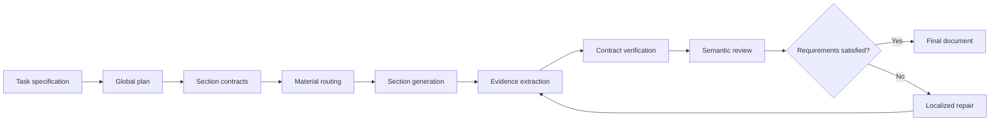

# ContractFlow

**Contract-guided planning, generation, verification, and repair for reliable long-form writing.**

[English](#english) | [中文](#中文)

## English

### Overview

ContractFlow is a research framework for generating long, structured documents with explicit intermediate constraints. Instead of asking a language model to produce an entire document from a single prompt, ContractFlow converts the task into a sequence of executable contracts that describe what each section must cover, how sections depend on one another, and which requirements must remain consistent across the document.

The framework coordinates specialized stages for global planning, section-level writing, evidence extraction, contract verification, semantic review, and localized repair. This design makes long-form generation easier to inspect, resume, evaluate, and improve without rewriting already-correct content.

ContractFlow is studied in three settings:

- Personalized long-form textbook generation.
- Structured long-context generation with LongGenBench-style tasks.
- Cross-domain long-writing transfer with LongBench-Write-style tasks.

### Motivation

Long-form generation is not only a length problem. As a document grows, a model must preserve global intent while satisfying many local requirements. Common failures include:

- Missing or misplaced required content.
- Inconsistent terminology, entities, chronology, or notation.
- Weak transitions and broken dependencies between sections.
- Repetition caused by limited awareness of earlier content.
- Expensive global rewrites when only a small region is incorrect.

ContractFlow addresses these problems by making document requirements explicit and executable throughout generation.

### Method



A contract can encode:

- Required topics, events, examples, formulas, or claims.
- Prerequisites and dependencies between sections.
- Continuity obligations from previous and future sections.
- Material-use requirements and source assignments.
- Structural, formatting, and length constraints.
- Assessment targets and section-level completion evidence.

After generation, ContractFlow extracts evidence from each section and checks it against the corresponding contract. Failed requirements are converted into targeted repair instructions, allowing the system to revise the affected section while preserving valid content elsewhere.

### Pipelines

| Pipeline | Description |
| --- | --- |
| `direct_prompt` | Generates the requested document directly from the task prompt. |
| `single_agent` | Uses one author model with an outline and staged section generation. |
| `full` | Runs the complete ContractFlow planning, contract, review, and repair workflow. |
| `no_contract` | Removes executable section contracts. |
| `no_material_routing` | Removes role-aware material routing. |
| `no_review_repair` | Generates from contracts without the review and repair loop. |

These variants support controlled comparisons between direct generation, staged generation, the full framework, and component ablations.

### Repository Structure

```text
learnbyai_research/
  contracts/                 Contract schemas, evidence, sequence checks, metrics
  eval/                      Pairwise judging and aggregate evaluation
  pipelines/                 Baselines, ablations, and the full pipeline
  adaptive_generation.py     Budget-aware adaptive generation engine
  longgenbench*.py           LongGenBench methods and evaluation utilities
  longbench_write_transfer.py
                              LongBench-Write transfer pipeline
  morelongwrite_optimized.py Optimized long-writing workflow
  llm.py                     OpenAI-compatible model client and mock model
  prompts.py                 Planning, writing, review, and repair prompts
  schemas.py                 Core task and output data structures
scripts/
  run_longgenbench.py        LongGenBench experiment entry point
  run_longbench_write_transfer.py
                              LongBench-Write experiment entry point
configs/                     Experiment configuration templates
tasks/                       Task specification templates
tests/                       Unit and integration tests
```

### Installation

ContractFlow requires Python 3.10 or later.

```bash
python -m venv .venv
python -m pip install -e .
```

### Model Configuration

ContractFlow uses role-based model configuration:

| Role | Purpose |
| --- | --- |
| `AUTHOR` | Global planning and initial section generation. |
| `REVIEW` | Semantic review and issue diagnosis. |
| `REPAIR` | Targeted revision of failed sections. |
| `JUDGE` | Blind evaluation of generated outputs. |

Create a local `.env` file from `.env.example` and configure the roles used by the selected pipeline. Each role supports an API key, model name, base URL, wire API, output budget, timeout, retry policy, and optional reasoning settings.

### Task Format

Textbook-generation tasks are JSON objects following `tasks/textbook_task.template.json`. A task describes the topic, learning goal, learner background, document structure, style preferences, and optional source materials.

```json
{
  "id": "",
  "topic": "",
  "goal": "",
  "background": "",
  "chapter_count": null,
  "chapter_min_characters": null,
  "chapter_target_characters": null,
  "difficulty": "",
  "learning_mode": "",
  "preference": "",
  "styles": [],
  "materials": []
}
```

### Quick Start

Run the complete pipeline with the deterministic mock model:

```bash
python -m learnbyai_research.cli generate \
  --task path/to/task.json \
  --pipeline full \
  --output runs/example/full.json \
  --mock
```

Run a baseline by changing `--pipeline`:

```bash
python -m learnbyai_research.cli generate \
  --task path/to/task.json \
  --pipeline single_agent \
  --output runs/example/single_agent.json \
  --mock
```

When model roles are configured, omit `--mock` to run with the selected models.

### Evaluation

Blindly compare two generated outputs:

```bash
python -m learnbyai_research.cli judge \
  --task path/to/task.json \
  --a runs/example/full.json \
  --b runs/example/single_agent.json \
  --output runs/example/judgment.json \
  --mock
```

Aggregate pairwise judgments:

```bash
python -m learnbyai_research.cli aggregate \
  --judgments runs/example/judgment.json \
  --output runs/example/summary.csv
```

Export contract-verification metrics:

```bash
python -m learnbyai_research.cli contract-metrics \
  --generations runs/example/full.json \
  --output runs/example/contract_metrics.csv
```

### Benchmark Workflows

For LongGenBench experiments:

```bash
python scripts/run_longgenbench.py --help
```

For LongBench-Write transfer experiments:

```bash
python scripts/run_longbench_write_transfer.py --help
```

The runners record experiment settings, checkpoints, model completion histories, timing information, and output artifacts for later analysis.

### Testing

```bash
python -m pytest
```

The test suite covers contract verification, sequence consistency, material routing, baseline behavior, review and repair, checkpoint recovery, adaptive generation, long-writing methods, evaluation, and mock end-to-end execution.

---

## 中文

### 项目简介

ContractFlow 是一个面向可靠长文本生成的契约引导研究框架。与直接要求语言模型一次性生成整篇文档不同，ContractFlow 会先将任务转化为一组可执行的结构化契约，明确每个章节或段落需要完成的内容、不同部分之间的依赖关系，以及贯穿全文的一致性要求。

系统将全局规划、章节写作、证据提取、契约验证、语义审查和局部修复组织成完整流程。这样的设计使长文本生成过程更加容易检查、恢复、评测和迭代，也能够在保留正确内容的同时，只修复真正存在问题的局部区域。

ContractFlow 主要研究以下三类任务：

- 个性化长篇教材生成。
- LongGenBench 风格的结构化长文本生成。
- LongBench-Write 风格的跨领域长写作迁移。

### 研究动机

长文本生成不仅仅是输出长度问题。随着文档不断增长，模型需要同时保持全局目标和大量局部约束，常见问题包括：

- 必需内容遗漏、错位或覆盖不完整。
- 术语、实体、时间线或符号在不同章节中不一致。
- 章节之间过渡薄弱，前置知识和后续内容衔接断裂。
- 对前文状态感知不足，导致重复或相互矛盾。
- 局部错误触发整篇重写，增加成本并破坏已有正确内容。

ContractFlow 通过贯穿生成全过程的可执行契约，让这些要求能够被明确记录、验证和修复。

### 方法流程

ContractFlow 首先根据任务生成全局规划，再为每个章节或段落建立局部契约。契约可以描述：

- 必须覆盖的主题、事件、示例、公式或论点。
- 章节之间的前置关系和依赖关系。
- 与前文衔接、为后文铺垫的连续性要求。
- 参考材料的用途和分配方式。
- 结构、格式和长度约束。
- 学习目标、评测目标以及完成证据。

章节生成后，系统会提取实际文本中的证据，并与对应契约逐项核对。未满足的要求会被转化为针对性的修复指令，使模型只修改失败章节，同时尽量保留其他已验证内容。

### 流程变体

| 流程 | 说明 |
| --- | --- |
| `direct_prompt` | 根据任务提示直接生成完整文档。 |
| `single_agent` | 由单一作者模型先生成提纲，再分阶段完成各章节。 |
| `full` | 执行完整的 ContractFlow 规划、契约、审查和修复流程。 |
| `no_contract` | 移除可执行章节契约。 |
| `no_material_routing` | 移除按角色分配参考材料的机制。 |
| `no_review_repair` | 使用契约生成内容，但不执行审查和修复循环。 |

这些流程用于比较直接生成、分阶段生成、完整方法以及不同组件消融后的表现。

### 代码结构

```text
learnbyai_research/
  contracts/                 契约结构、证据提取、顺序检查和指标
  eval/                      成对盲评与聚合评测
  pipelines/                 基线、消融和完整流程
  adaptive_generation.py     面向预算的自适应生成引擎
  longgenbench*.py           LongGenBench 方法和评测工具
  longbench_write_transfer.py
                              LongBench-Write 迁移流程
  morelongwrite_optimized.py 长文本优化流程
  llm.py                     OpenAI 兼容模型客户端与 Mock 模型
  prompts.py                 规划、写作、审查和修复提示词
  schemas.py                 核心任务与输出数据结构
scripts/                     实验运行入口
configs/                     实验配置模板
tasks/                       任务定义模板
tests/                       单元测试与集成测试
```

### 安装

ContractFlow 需要 Python 3.10 或更高版本。

```bash
python -m venv .venv
python -m pip install -e .
```

### 模型配置

ContractFlow 按照不同职责配置模型：

| 角色 | 用途 |
| --- | --- |
| `AUTHOR` | 全局规划和初始章节生成。 |
| `REVIEW` | 语义审查和问题诊断。 |
| `REPAIR` | 对未通过验证的章节进行局部修复。 |
| `JUDGE` | 对不同系统生成结果进行盲评。 |

可以参考 `.env.example` 创建本地 `.env`。每个角色可以配置 API 密钥、模型名称、接口地址、调用协议、输出预算、超时、重试策略和推理设置。

### 任务格式

教材生成任务采用 JSON 格式，字段定义见 `tasks/textbook_task.template.json`。任务可以描述主题、学习目标、学习者背景、章节结构、风格偏好和参考材料。

### 快速开始

使用确定性的 Mock 模型运行完整流程：

```bash
python -m learnbyai_research.cli generate \
  --task path/to/task.json \
  --pipeline full \
  --output runs/example/full.json \
  --mock
```

运行单智能体基线：

```bash
python -m learnbyai_research.cli generate \
  --task path/to/task.json \
  --pipeline single_agent \
  --output runs/example/single_agent.json \
  --mock
```

完成模型配置后，移除 `--mock` 即可调用实际模型。

### 评测

对两个生成结果进行盲评：

```bash
python -m learnbyai_research.cli judge \
  --task path/to/task.json \
  --a runs/example/full.json \
  --b runs/example/single_agent.json \
  --output runs/example/judgment.json \
  --mock
```

聚合成对评测结果：

```bash
python -m learnbyai_research.cli aggregate \
  --judgments runs/example/judgment.json \
  --output runs/example/summary.csv
```

导出契约验证指标：

```bash
python -m learnbyai_research.cli contract-metrics \
  --generations runs/example/full.json \
  --output runs/example/contract_metrics.csv
```

### Benchmark 实验

查看 LongGenBench 实验参数：

```bash
python scripts/run_longgenbench.py --help
```

查看 LongBench-Write 迁移实验参数：

```bash
python scripts/run_longbench_write_transfer.py --help
```

实验运行器会记录配置、检查点、模型调用历史、耗时和生成结果，便于后续分析与复现。

### 测试

```bash
python -m pytest
```

测试覆盖契约验证、顺序一致性、材料路由、基线流程、审查与修复、检查点恢复、自适应生成、长文本方法、评测逻辑和 Mock 端到端执行。
